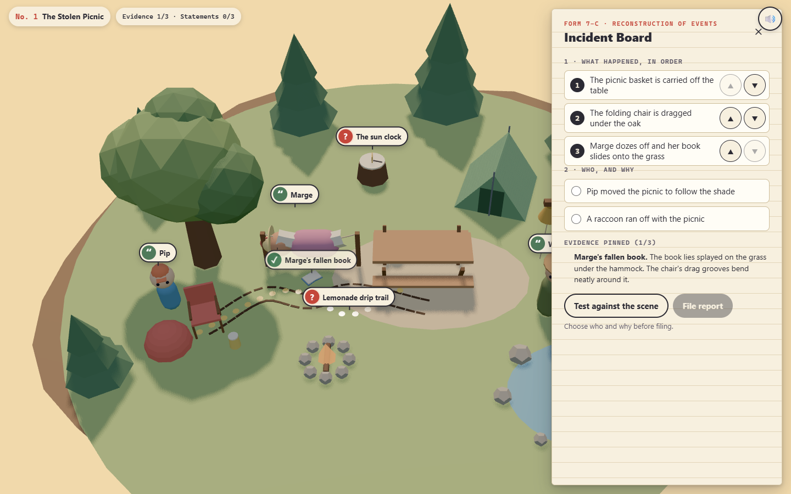
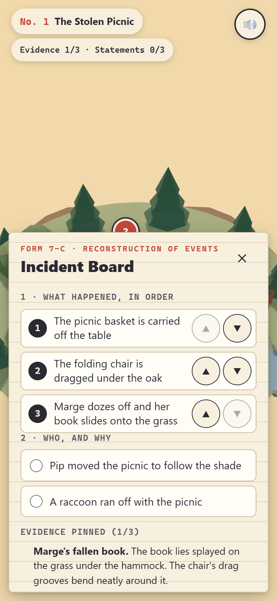

<p align="center"></p>

<p align="center">
  <a href="https://09-the-campsite-has-questions.williamking.workers.dev"></a>
  
  
  
  
  
  
</p>

**A cosy miniature mystery about physical evidence and unreliable campers.** Something ridiculous has happened at a tiny campground. Inspect the clues, hear the campers out, then test your reconstruction against the scene itself.

<p align="center"></p>

## How to play

1. **Read the incident form**, then press *Begin investigation*.
2. **Inspect evidence.** Every clue has a red **?** tag in the scene, so there is no pixel hunting. Pick up a sample and turn it by dragging, with the arrow keys or with the ◀ ▲ ▼ ▶ buttons.
3. **Talk to the campers.** Tap a name tag to hear a statement. Some witnesses are confident and wrong; once you find the evidence against a statement, it is stamped *doubtful*.
4. **Open the Incident Board** (button or `B`). Put the three events in order, then choose who did it and why.
5. **Test against the scene.** The camp replays your version. A beat that contradicts found evidence stops the replay and rings the clue in red; a beat nothing backs up yet shows as unproven.
6. **File the report.** A wrong report is returned by the Campground Committee and costs an acorn. A correct one plays the official reconstruction and your illustrated report. Close three cases to finish the season.

| Input | Keys and gestures |
| --- | --- |
| Look around, turn evidence | Drag, or the arrow keys |
| Incident Board | `B` |
| Close a panel | `Esc` |
| Mute (remembered) | `M` or the corner button |
| Move between controls | `Tab` |

## What's inside

- **Three fair cases:** the picnic in the afternoon, the tent in the rain, the bell at dawn.
- **Deduction by relationship:** one clue orders two events, a second orders another pair, the third decides the explanation. No single clue settles a case.
- **Proof the puzzles are fair:** unit tests check that exactly one reconstruction survives all three clues.
- **An animated replay** of your theory, stopped by the evidence it contradicts.
- **An illustrated incident report** for every closed case.
- **Sound for every beat:** a cosy score, per-case ambience (birds, rain, crickets at dawn) and effects that duck under reconstructions.
- **Accessible by default:** keyboard throughout, and reduced motion jumps straight to each beat's outcome.

## Screenshots

| Desktop | Phone |
| --- | --- |
|  |  |

## Built with

Three.js for the procedural campground, cast and evidence turntable; React and Tailwind CSS for the incident-book interface; GSAP for the replays; TypeScript throughout; Vite and Bun for the build.

- **Rules first:** the cases, clue relationships and reconstruction evaluation live in pure TypeScript in `src/game/`, tested independently of the scene.
- **Evidence you can hold:** each clue becomes a small turntable object you can rotate before reading it.

## Run it locally

```sh
bun install --frozen-lockfile
bun run dev      # http://127.0.0.1:4519/
bun run check    # tsc, Biome, bun test, production build into dist/
bun run preview  # http://127.0.0.1:4619/
```

`src/game/` holds the rules and case data, `src/scene/` the three.js campground, `src/ui/` the React interface, and `src/loader.ts` the arrival veil.

## Credits

All geometry, materials and animation are authored procedurally in code; there are no external models, textures or fonts. Libraries: three.js, GSAP, React and Tailwind CSS.

Audio, all **CC0 1.0** (credited with thanks, though not required):

| File(s) in `public/audio/` | Source | Author | Licence |
| --- | --- | --- | --- |
| `music-cozy.mp3` ("Cozy Puzzle In-Game 1") | https://opengameart.org/content/cozy-puzzle-in-game-1 | MintoDog | CC0 |
| `amb-birds.mp3` ("Ambient Bird Sounds") | https://opengameart.org/content/ambient-bird-sounds | isaiah658 | CC0 |
| `amb-rain.mp3` ("Rain (loopable)") | https://opengameart.org/content/rain-loopable | Ylmir | CC0 |
| `amb-crickets.mp3` ("Crickets Ambient Noise - loopable") | https://opengameart.org/content/crickets-ambient-noise-loopable | Wolfgang_ | CC0 |
| `sfx-click`, `sfx-turn`, `sfx-talk`, `sfx-tick`, `sfx-select`, `sfx-beat-ok`, `sfx-beat-unproven`, `sfx-contradiction`, `sfx-returned`, `sfx-begin` | Interface Sounds, https://kenney.nl/assets/interface-sounds | Kenney (kenney.nl) | CC0 |
| `sfx-pickup`, `sfx-board-open`, `sfx-board-close`, `sfx-kettle`, `sfx-creak`, `sfx-book`, `sfx-cloth`, `sfx-peg` | RPG Audio, https://kenney.nl/assets/rpg-audio | Kenney (kenney.nl) | CC0 |
| `sfx-stamp`, `sfx-bell`, `sfx-step`, `sfx-thud` | Impact Sounds, https://kenney.nl/assets/impact-sounds | Kenney (kenney.nl) | CC0 |
| `sfx-jingle-closed`, `sfx-jingle-finale` | Music Jingles (Pizzicato), https://kenney.nl/assets/music-jingles | Kenney (kenney.nl) | CC0 |

---

<p align="center"><sub>Part of William King's portfolio collection.</sub></p>
