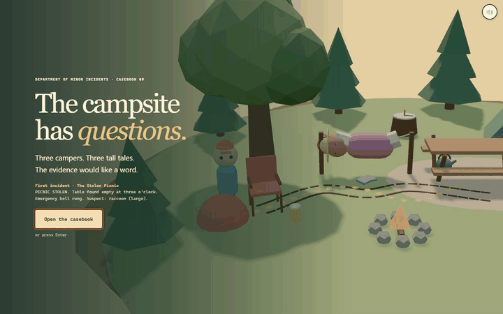
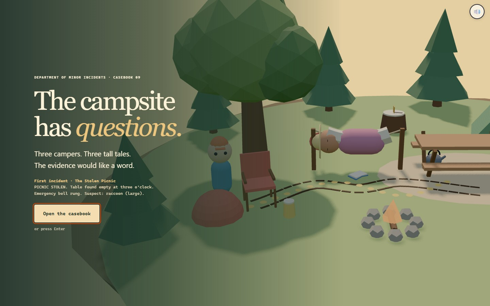
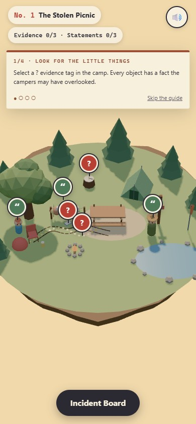
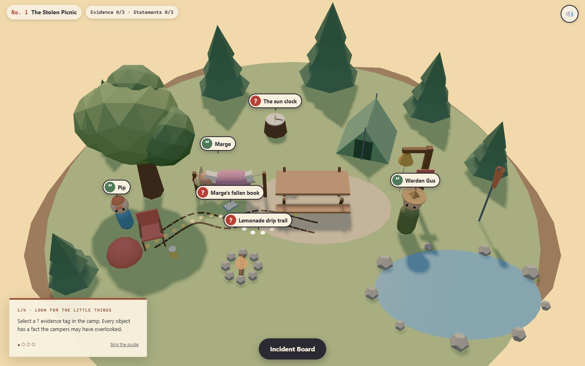

# THE CAMPSITE HAS QUESTIONS

<p align="center"></p>

Physical evidence, confident campers and three ridiculous incidents. Inspect a miniature campground, test the witnesses against the clues and reconstruct what really happened. The camp acts out your theory, including the parts the evidence cannot support.

**[Open the casebook →](https://09-the-campsite-has-questions.williamking.workers.dev)** · [Run locally](#run-locally) · [Credits](#credits)

<p align="center"></p>

## Investigate, then make your case

1. **Open the casebook.** The camera introduces the camp; an optional four-step guide follows inspection, evidence, the board and a report. Help can be replayed.
2. **Inspect marked clues.** Red question tags make evidence discoverable without pixel hunting. Turn a sample by dragging, using arrows or pressing its rotation controls.
3. **Hear the campers out.** A statement becomes doubtful when you have found the evidence against it. Confidence is not the same as accuracy.
4. **Build a reconstruction.** On the Incident Board, order three events and choose an actor and explanation.
5. **Test your theory.** The scene replays the chosen version. Contradictions stop at the relevant beat and mark the clue; unsupported beats stay unproven.
6. **File the report.** A rejected report costs an acorn. A correct one produces the official reconstruction and illustrated report. Close all three cases to finish the season.

| Action | Input |
| --- | --- |
| Inspect / speak | Click or tap a clue or name tag |
| Look around / rotate evidence | Drag or arrow keys |
| Open Incident Board | B or the Board button |
| Close a panel | Escape or its close control |
| Navigate controls | Tab, then Enter or Space |
| Toggle sound | M or Sound |

## Three times of day, three fair puzzles

An afternoon picnic, a rain-soaked tent and a dawn bell each supply a different scene, evidence set and ambience. Clues establish relationships between events, so the answer emerges from their combination. The tests check the possible event orders and ensure the complete evidence admits the intended reconstruction.

The current replay uses the selected theory rather than revealing an unchosen cause. Repeated reconstructions retain and reset scene geometry, including the hammock, without accumulating replacement buffers. Input and modal focus remain usable on compact portrait and landscape screens; reduced motion jumps to each beat's meaningful outcome.

## Implementation and verification

[src/game/](src/game/) contains cases, deductions and state; [src/scene/](src/scene/) draws evidence and reconstructions; [src/ui/](src/ui/) owns the notebook, board and reports. Audio and scene work are canceled and released when the view is reset or disposed.

Application revision `d913446` passed **64 tests / 1,050 assertions**, seven RTX 2060 scenarios and a final full-season report regression. Coverage includes all cases, replay, repeated reconstructions, three touch sizes, input ownership and startup/runtime recovery. See the [bug-pass report](docs/visual/BUG-PASS-2026-09-30.md).

## Current screenshots

| Desktop | Phone |
| --- | --- |
|  |  |



The opening loop and three main screenshots were captured from the live site on **1 October 2026**, using Chrome on this workstation; the phone image is a 390 × 844 browser viewport. The animated preview is a short loop, not a full playthrough. [Capture details](docs/readme/capture.json).

## Run locally

Use **Bun 1.3.10** (the version pinned in `package.json`) and Node.js 22.12 or newer. From this repository:

```sh
bun install --frozen-lockfile
bun run dev      # http://127.0.0.1:4519/
bun run check    # strict types, Biome, unit tests and production build
bun run preview  # http://127.0.0.1:4619/ after the build
```

Development and preview are separate long-running commands; run one at a time or use separate terminals. `bun run build` writes the static production output to `dist/`. Dependencies and the lockfile are local to this project.

### Browser suite

Install the test browser once, then run the checked-in Playwright suite. Its configuration builds and starts the production preview. Browser scenarios are separate from `bun run check`.

```sh
bunx playwright install chromium
bun run e2e
```

The recorded real-GPU release checks used installed Chrome on an RTX 2060; the default Chromium configuration is not a claim of physical-phone coverage.

## Stack and release

Direct Three.js 0.186 · React 19.3 · strict TypeScript · Vite 8.3 · GSAP 3.15 · Tailwind CSS 4.3 · Bun 1.3.10 · Biome. The public website is served by Cloudflare Workers. This README describes [application revision d913446](https://github.com/WilliamHenryKing/09-the-campsite-has-questions/commit/d9134466674a4e2be378c80a5dff9c4635009a2e); the documentation refresh changes no application behaviour.

## Credits

All geometry, materials and animation are authored procedurally in code; there are no external models, textures or fonts. Libraries: three.js, GSAP, React and Tailwind CSS.

Audio, all **CC0 1.0** (credited with thanks, though not required):

| File(s) in `public/audio/` | Source | Author | Licence |
| --- | --- | --- | --- |
| `music-cozy.mp3` ("Cozy Puzzle In-Game 1") | [Source](https://opengameart.org/content/cozy-puzzle-in-game-1) | MintoDog | CC0 |
| `amb-birds.mp3` ("Ambient Bird Sounds") | [Source](https://opengameart.org/content/ambient-bird-sounds) | isaiah658 | CC0 |
| `amb-rain.mp3` ("Rain (loopable)") | [Source](https://opengameart.org/content/rain-loopable) | Ylmir | CC0 |
| `amb-crickets.mp3` ("Crickets Ambient Noise - loopable") | [Source](https://opengameart.org/content/crickets-ambient-noise-loopable) | Wolfgang_ | CC0 |
| `sfx-click`, `sfx-turn`, `sfx-talk`, `sfx-tick`, `sfx-select`, `sfx-beat-ok`, `sfx-beat-unproven`, `sfx-contradiction`, `sfx-returned`, `sfx-begin` | Interface Sounds, [Source](https://kenney.nl/assets/interface-sounds) | Kenney (kenney.nl) | CC0 |
| `sfx-pickup`, `sfx-board-open`, `sfx-board-close`, `sfx-kettle`, `sfx-creak`, `sfx-book`, `sfx-cloth`, `sfx-peg` | RPG Audio, [Source](https://kenney.nl/assets/rpg-audio) | Kenney (kenney.nl) | CC0 |
| `sfx-stamp`, `sfx-bell`, `sfx-step`, `sfx-thud` | Impact Sounds, [Source](https://kenney.nl/assets/impact-sounds) | Kenney (kenney.nl) | CC0 |
| `sfx-jingle-closed`, `sfx-jingle-finale` | Music Jingles (Pizzicato), [Source](https://kenney.nl/assets/music-jingles) | Kenney (kenney.nl) | CC0 |

---

Part of [William King's portfolio collection](https://github.com/WilliamHenryKing).
